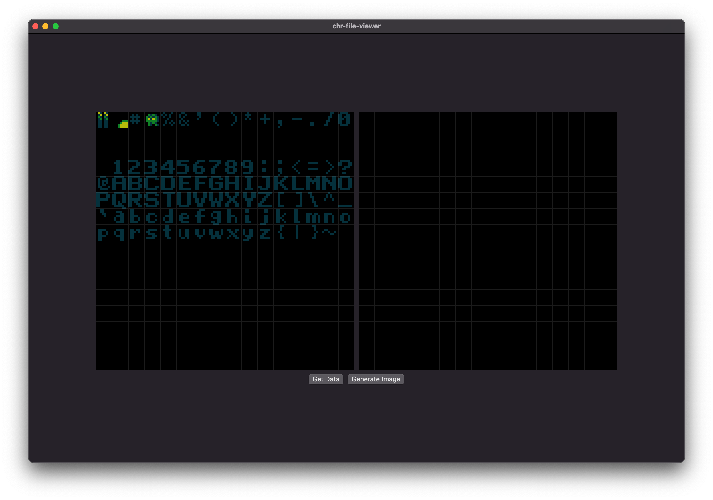

# macOS-nes-chr-viewer
A macOS app to view CHR sprite data (Nintendo NES).

This is a very much WORK IN PROGRESS, totally messy and a first prototype to display the data.

Information about CHR sprites from the NES are taken from here: https://erikonarheim.com/posts/nes-sprite-editor/

Iterating through image data is take from: https://github.com/yamoridon/ColorThiefSwift

